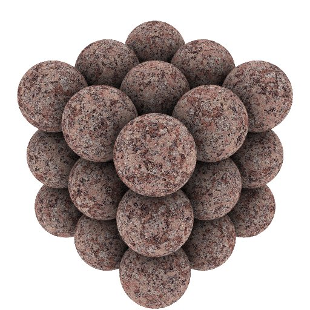
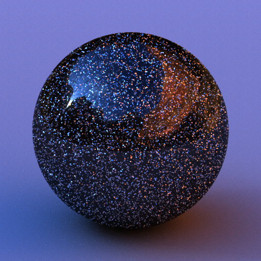
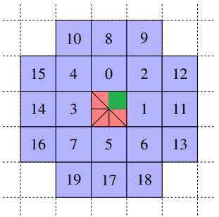

# voroce

## What is this?

**voroce** is a fast and simple voronoi class useful to create images like the above ones.
**voroce** is a coind word of **voronoi** & **veloce**.

## Introduction

[Voronoi](http://www.rhythmiccanvas.com/research/papers/worley.pdf) is very useful for generating interesting patterns. Surprisingly, however, I have not found much literature on how to compute them efficiently. The most relevant work to this project was done by [Jontier et al.](http://jcgt.org/published/0008/01/02/paper.pdf) who proposed an optimal visiting order for efficient cellular noise generation. In the 2D case, they describe the order of 20 neighboring cells, but I think it is not optimal because some cells do not need to be visited (let me know if I'm wrong :-)). If the shading point is in the green region and each cell has at least one sample point, it is not necessary to visit the cells 10, 13, 14, 15, 16, 17, 18, and 19. (For example, the cell 10 cannot have a sample point closer than the one in the cell 0.) In [voronoise](https://iquilezles.org/www/articles/voronoise/voronoise.htm) by Inigo Quilez, sample points are jittered so that cell noise and voronoi can be generated in a single framework. The number of neighboring cells to be visited depends on the amount of jitter.

|      |  naive implementation | optimized (0.5 < jitter) | optimized (0.5 >= jitter) |
| ---- | --------------------: | -----------------------: | ------------------------: |
|  2d  |       5^2 - 2^2 =  21 |                       13 |                         4 |
|  3d  |       5^3 - 2^3 = 117 |                       39 |                        20 |
|  4d  |       5^4 - 2^4 = 609 |                      195 |                       85? |

## Features

* sample point jittering (grid <-> voronoi)
* optimized code path for small jitter values

I have a couple of ideas to speed up. So stay tuned!

## Cost Comparison

### Time (relative to naive 2d implementation)

|      |  naive implementation | optimized (0.5 < jitter) | optimized (0.5 >= jitter) |
| ---- | --------------------: | -----------------------: | ------------------------: |
|  2d  |                  1.00 |                     0.61 |                      0.33 |
|  3d  |                  6.37 |                     1.23 |                      0.83 |
|  4d  |                 44.76 |                     8.79 |                      4.08 |

## Dependencies
* [glm](https://github.com/g-truc/glm)
