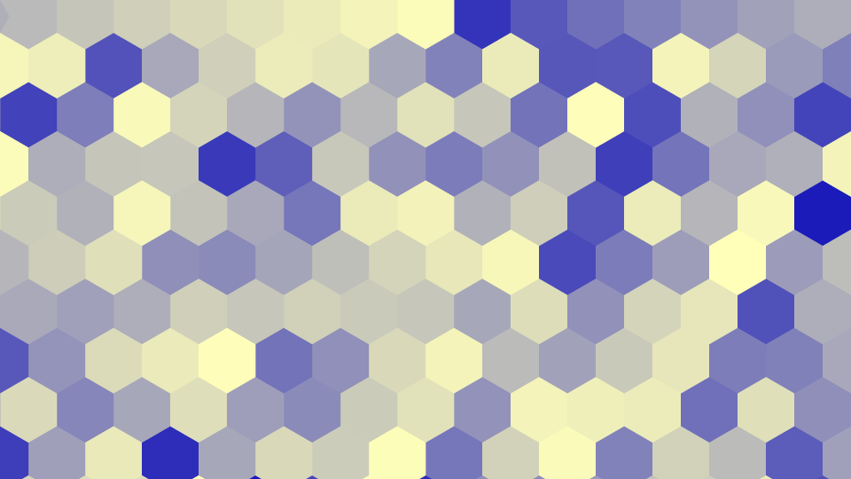

# voroce

## What is this?

**voroce** is a fast and simple voronoi class useful to create images like the above ones. **voroce** is a coind word of **voronoi** & **veloce**.

[Voronoi](http://www.rhythmiccanvas.com/research/papers/worley.pdf) is very useful for generating interesting patterns. Surprisingly, however, I have not found much literature on how to compute them efficiently. The most relevant work to this project was done by [Jontier et al.](http://jcgt.org/published/0008/01/02/paper.pdf) who proposed an optimal visiting order for efficient cellular noise generation. In the 2D case, they gave the order of 20 neighboring cells, which I think is not optimal because some cells do not need to be visited (let me know if I'm wrong :-)). If the shading point is in the green region and each cell has at least one sample point, it is unnecessary to visit the cells 10, 13, 14, 15, 16, 17, 18, and 19. (For example, the cell 10 cannot have a sample point closer than the one in the cell 0.) In [voronoise](https://iquilezles.org/www/articles/voronoise/voronoise.htm) by Inigo Quilez, sample points are jittered so that cell noise and voronoi can be generated in a single framework. The number of neighboring cells to be visited depends on the amount of jitter.

Table 1: The number of cells to traverse

| dim / cell shape |  naive implementation | optimized (0.5 < jitter) | optimized (0.5 >= jitter) |
| ---------------- | --------------------: | -----------------------: | ------------------------: |
|   2D / rectangle |       5^2 - 2^2 =  21 |                       13 |                         4 |
|   3D             |       5^3 - 2^3 = 117 |                       39 |                        20 |
|   4D             |       5^4 - 2^4 = 609 |                      195 |                       85? |
|   2D /  triangle |       3^2       =   9 |              coming soon |               coming soon |

## Features

* [x] sample point jittering
* [x] optimized code path for small jitter values
* [x] triangle (2D)
* [ ] optimized triangle (2D)
* [ ] honeycomb (2D)
* [ ] optimized honeycomb (2D)
* [x] cache (2D) (brings nearly 2x speedup for primary rays)
* [x] cache (3D) (brings nearly 2x speedup for primary rays)
* [ ] cache (4D)

I have many ideas. Stay tuned!

## Cost Comparison

Table 2: Time (relative to naive 2d implementation)
|      |  naive implementation | optimized (0.5 < jitter) | optimized (0.5 >= jitter) |
| ---- | --------------------: | -----------------------: | ------------------------: |
|  2d  |                  1.00 |                     0.61 |                      0.33 |
|  3d  |                  6.37 |                     1.23 |                      0.83 |
|  4d  |                 44.76 |                     8.79 |                      4.08 |

## Dependencies
* [glm](https://github.com/g-truc/glm)
