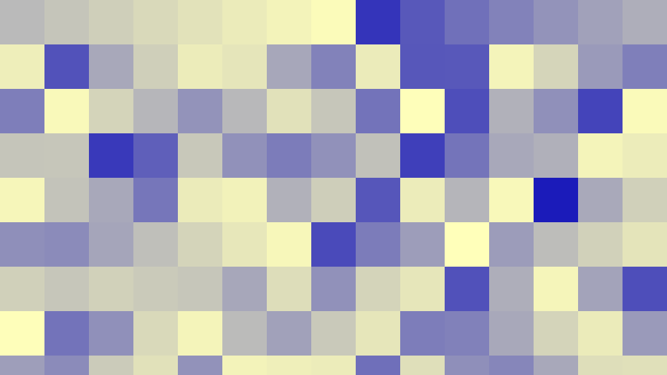

# voroce

## What is this?

**voroce** is a simple voronoi library useful to create images like the above ones. **voroce** is a coind word of **voronoi** & **veloce**.
Please feel free to use in your software. I would be happy if you credit my name.
However, mind that the copyrightholder of the SDF functions used in **veloce** is Inigo Quilez.

[Voronoi](http://www.rhythmiccanvas.com/research/papers/worley.pdf) is very useful for generating interesting patterns. Surprisingly, however, I have not found much literature on how to compute them efficiently. The most relevant work to this project was done by [Jontier et al.](http://jcgt.org/published/0008/01/02/paper.pdf) who proposed an optimal visiting order for efficient cellular noise generation. In the 2D rectangular grid case, they gave the order of 20 neighboring cells, which I think is not optimal because some cells do not need to be visited (let me know if I'm wrong :-)). If the shading point is in the green region and each cell has at least one sample point, it is unnecessary to visit the cells labeled 10, 13, 14, 15, 16, 17, 18, and 19. For example, the cell labeled 10 cannot have a sample point closer than the one in the cell labeled 0.

Note that the underlying grid does not have to be rectangular. We can use triangular and hexagonal grids as well.

In [voronoise](https://iquilezles.org/www/articles/voronoise/voronoise.htm) by Inigo Quilez, sample points are jittered so that cell noise and voronoi can be generated in a single framework. The number of neighboring cells to be visited depends on the amount of jitter.

Table 1: The number of cells to traverse

| dim / cell shape |  naive implementation | optimized (0.5 < jitter) | optimized (0.5 >= jitter) |
| ---------------- | --------------------: | -----------------------: | ------------------------: |
|   2D / rectangle |       5^2 - 2^2 =  21 |                       13 |                         4 |
|   3D             |       5^3 - 2^3 = 117 |                       39 |                        20 |
|   4D             |       5^4 - 2^4 = 609 |                      195 |                       85? |
|   2D /  triangle |   25 triangular cells |              coming soon |               coming soon |
|   2D /   hexagon |   19  hexagonal cells |              coming soon |               coming soon |

## Features

* [x] sample point jittering
* [x] optimized code path for small jitter values
* [x] triangular grid (2D)
* [ ] optimized triangular grid (2D)
* [x] hexagonal grid (2D)
* [ ] optimized hexagonal grid (2D)
* [x] cache (2D) (brings nearly 2x speedup for primary rays)
* [x] cache (3D) (brings nearly 2x speedup for primary rays)
* [x] cache (4D) (brings **over** 3x speedup for primary rays)
* [x] sharp & round voronoi edges (2D rectangular grid)
* [ ] sharp & round voronoi edges (2D triangular grid)
* [ ] sharp & round voronoi edges (2D hexagonal grid)

I have many ideas. Stay tuned!

## Cost Comparison

Table 2: Time (relative to naive 2d implementation)
|      |  naive implementation | optimized (0.5 < jitter) | optimized (0.5 >= jitter) |
| ---- | --------------------: | -----------------------: | ------------------------: |
|  2d  |                  1.00 |                     0.61 |                      0.33 |
|  3d  |                  6.37 |                     1.23 |                      0.83 |
|  4d  |                 44.76 |                     8.79 |                      4.08 |

## Dependency
* [glm](https://github.com/g-truc/glm)
